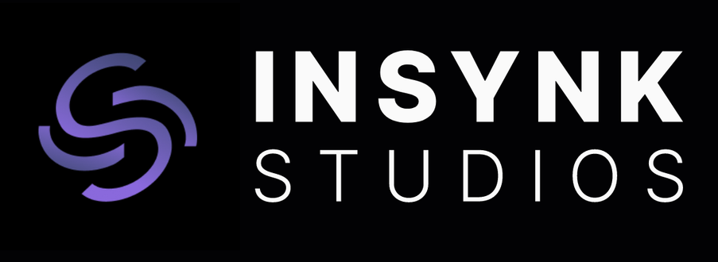

<h1 align="center">
   
  InSynk Studios
</h1>

 A movie discovery app built in react. This app will display movies in a grid and give the user more information when they click on one of the posters. To fetch the movie info, we will be using The Movie DB and will include the API key for you to add to the .env in the initial email.

Ref : 
- The Movie DB : [TMDB](https://developers.themoviedb.org/3/getting-started/introduction)
- Figma Design : [Design](https://www.figma.com/file/IjgekvfLkQalZgcNDwAzhw/Movie-Grid---InSynk-Studios?node-id=0%3A1&t=yOG3AB3yScHS3ZJl-1)
